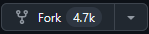
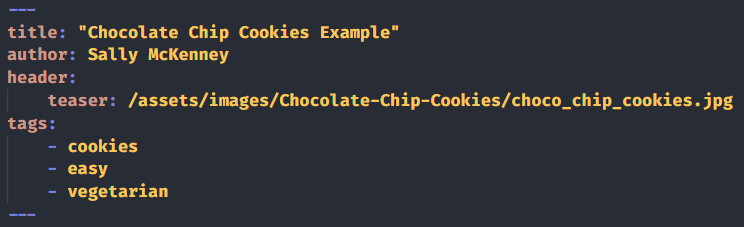

# [Recipeez Jekyll theme](github.com/poinkpolkadots/recipeez)

An easy to use theme to help you keep track of or publish your recipes.

## How to use this theme
recipeez is designed to be as easy to use as possible. In order to start up your own website, you can utilize [GitHub Pages](https://docs.github.com/en/pages/setting-up-a-github-pages-site-with-jekyll), which hosts your website for free.

Below are the steps to get started with GitHub Pages.

## Step one, clone this GitHub Repository
To clone this respository, click on the "fork" button in the upper right hand of this page:

You must name the repository `<username>.github.io`.

Your website will be visible at `https://<username>.github.io`.

You can customize some basic information in `_config.yml`.

## Step two, add recipes!
You can put all recipes in the `_posts` folder in this repository.

Recipes are written in markdown, don't worry though, it's not that hard! You should title your post files like this: `YYYY-MM-DD-name-of-post.md`.

I recommend [this tutorial](https://www.markdowntutorial.com/) to learn the basics of markdown, but a few example pages are provided in this repository to help you get started.

### Front Matter

At the top of the markdown file, you should include some "front matter", enclosed in triple dashes. It will look something like this:

This will give the website some basic information to display and sort the page by. To see all of all front matter tags, look at the Minimal Mistakes website [here](https://mmistakes.github.io).

### Recipe Content

You can look at the example pages provided to get an idea of some of the content that you can put in your recipe page, and how to do it. You have the ability to fully customize how your recipes look using markdown, so go wild!

## Step three, customize more!

Once you've set up your basic page, I recommend trying to customize it! You can customize any of the files in here to get your desired look. The `_layouts` folder includes the baseline html pages which are used to construct pages from your markdown files. The styling is done through the sass files in the `_sass`. I recommend [this tutorial](https://jekyllrb.com/docs/themes/) to learn how jekyll themes are laid out. You can also look at the [Minimal Mistakes website](https://mmistakes.github.io) for further documentation.

One important thing to note: The author bio is disabled by default on this theme. If you want to re-enable it, you should go to `_config.yml` and change `author_profile: false` to `author_profile: true`. or include `author_profile: true` in the front matter of your markdown file.

# Thanks for checking out recipeez!

Based on [Minimal Mistakes](https://github.com/mmistakes) by Michael Rose